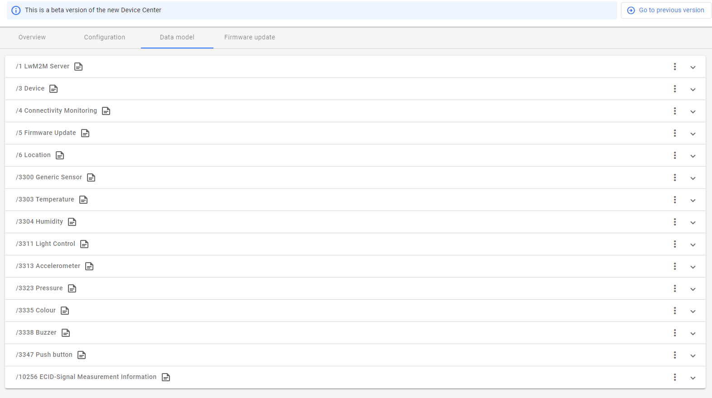

# mobile_weather_station_workshop
With global warming and the environmental challenges, there is a growing need for monitoring in our surroundings to sustain a healthy and sustainable world.
In this workshop Nordic Semiconductor will teach you how to create a power-efficient mobile weather station using the Nordic Thingy:91 cellular IoT prototyping platform. They will make use of the low power benefits of the LwM2M, which is an application-level protocol especially designed for low-power data usage that can make your application run for years.

Features of this mobile weather station will have:
* Temperature
* Huminity
* Air Pressure
* Air Quality
* Environment Light
* Rain Detection
* Location(GNSS/MCELL)
* Fall Dection(Accelerometer)
* Search Mode(Help to find in dark or hidden environment using Buzzer and ColorLED)
* Solar energy for powering or battery charging

## HW Requirements
--------------------------------------
- Thingy91
- nRF9160DK for programming and debugging (or another compatible programmer)
- 10-pin SWD programming cable, like [this one](https://www.adafruit.com/product/1675)
- 2x USB Micro-B cables (one for the Thingy91 and one for the nRF9160DK)
- [Nowi Enery Autonomous plug-in board for Thingy:91](https://devzone.nordicsemi.com/nordic/nordic-blog/b/blog/posts/nowi-powered-energy-autonomous-nordic-thingy-91-platform)

## SW Requirements
--------------------------------------
- nRF Connect for Desktop
   - Toolchain manager (Windows and Mac only)
- Visual Studio Code (from here on referred to as VSCode)
   - nRF Connect for VSCode extension
- nRF Connect SDK v2.1.0 (installed through the Toolchain manager)

- This workshop will use [Coiote IoT Device Management Platform](https://www.avsystem.com/products/coiote-iot-device-management-platform/) as LwM2M server. You can to regiter a free developer account from Nordic Solutions Partener Avsystem for testing usage. 

For instructions on how to install these items, please follow the exercise [here](https://academy.nordicsemi.com/topic/exercise-1-1/).

## Workshop Steps
--------------------------------------
### Step 1 - Generate a new project from the original nrf9160 lwm2m_client sample

In VSCode, in the Welcome page of the nRF Connect interface, click on 'Create a new application from sample'. Hint: A faster way to do this is to bring up the command palette in VSCode (by pressing F1), typing 'new application', and pressing Enter.

Ensure that 'Freestanding' application is selected and that the nRF Connect SDK version and selected toolchain is based on v2.1.0. Select the nrf/samples/nrf9160/lwm2m_client sample as a reference, and give the application a new name such as 'mobile_weather_station_workshop':

Find the "mobile_weather_station_workshop" application in the Applications list, and click on 'Add Build Configuration'. Select the board 'thingy91_nrf9160_ns'. Add Kconfig fragment "overlay-avaystem" to choose Avsystem Coiote IoT Device Management Platform as LwM2M server. Check the 'Enable debug options' box, and click on 'Build Configuration':

Ensure that the nRF9160DK and the Thingy91 are connected as described here. Also make sure they are powered on. Open the build output in the terminal window, and wait for the code to finish building.

To show log output from the Thingy91 it is necessary to connect to one of two virtual CDC comports enumerated by the Thingy when it is connected over USB. The nRF9160DK will also enumerate various comports, and the easiest way to find out which comport is for log output from the Thingy you can use the LTE Link Monitor app available through nRF Connect for Desktop. Simply connect to the Thingy91 from the LTE Link Monitor, and check which comport the link monitor opens:
   

Close the LTE Link Monitor, and go back to VSCode. Select the nRF Terminal, and click on the 'Start Terminal With New Configuration' button:

When prompted to select connection mode at the top of VSCode, select 'Serial Port'. 
When prompted to select the comport select the comport that was used by the LTE Link Monitor earlier. 
When prompted to choose configuration select '115200 8n1'. 
  
Flash the code into the Thingy91, and ensure that the boot message shows up in the nRF Terminal:

### Step 2 - Add device to Coiote IoT Device Management Platform
In Device Inventory page, press the add device button then choose add your LwM2M device via the Managment server.

Enter the following data and click Add device:

- Endpoint - urn:imei:your Device IMEI. The IMEI value is printed on the development kit.
urn:imei:351358811483350

- Friendly Name - recognizable name.

- Security mode - psk (Pre-Shared Key).

- Key - 000102030405060708090a0b0c0d0e0f. Make sure to select the Key in hexadecimal checkbox.

Continute with Connect your device and rest Thingy:91. You will see the page and log give following device connected informaiton.
 
 

The device page shows an overviewer of the current state of LwM2M client.

 

### Step 3 - Get sensor data from weather station

The device page provides following data models.
 

Object 1 provide basic informaitona about the LwM2M server state.

/1 LwM2M Server 

Objects 3-6 provide information about the LwM2M client device itself, LTE connection state, current location and FOTA feature.

/3 Device

/4 Connectivity Monitoring

/5 Firmware Update

/6 Location

/10256 ECID-Signal Measurement Information

Thingy:91 has sensors or features to provide the following data. LwM2M has corresponding data models to show them as predefined objects.

/3300 Generic Sensor(Gas resistace data that can evluate the air quality change)

/3303 Temperature

/3304 Humidity

/3323 Pressure(air pressure)

/3313 Accelerometer (Can show the position of device, info if weather station is fall down)

/3335 Color(BH1749 Light sensor)

/3311 Light Control(to set the threecolor LED)

/3338 Buzzer

/3347 Push Button

Let's use Temperature boject as one example to see how to get temperature data from this weather station. The easy and straight way is read resource /5700 Sensor Value when you need it, but the more smart and power-efficient way is send observation configure to LwM2M client to let it notify server only when it is necessary. The following configuration set Notification Conditions: the notification of a Resource value will be sent when:
- a valid Change Value Condition ("Greater Than 40", "Less Than -10", OR "Step 5") - if any is defined - AND the "Minimum
Period" 60 seconds Timing Conditions are both fulfilled for that Resource OR
- the "Maximum Period" 300 seconds Timing Condition is fulfilled.

 

See [LightweightM2M_Core Specification](http://www.openmobilealliance.org/release/LightweightM2M/V1_1-20180710-A/OMA-TS-LightweightM2M_Core-V1_1-20180710-A.pdf) Section 5.1.2 for more explanation.

Let's light the red LED to let the weather station visuable on dark.
 

### Step 4 - Add Rain Sensor 
This step will demonstrate how to add a new sensor object to this mobile weather station. The target is to add one simple rain sensor to indicate if there is rain falling or not, so we will just use digital output pin on the board. Thingy:91 has not reserv many extra pins for other useage. Luckly  [Nordic Thingy:91 Hardware User Guide](https://infocenter.nordicsemi.com/index.jsp?topic=%2Fug_thingy91%2FUG%2Fthingy91%2Fhw_description%2Fhw_testpoints.html&cp=10_0_4_11_2) shows TP32 which connect with P0.13 is avaliable since we do not use pwm2 to control NMOS, and also P5 can provide 3.3V power output, so we can connect the rain sensor with Thingy:91.

 

- VCC is the power supply pin of the Rain Detection Sensor that can be connected to 3.3V or 5V of the supply. But do note that the analog output will vary depending upon the provided supply voltage.
- GND is the ground pin of the board and it should be connected to the ground pin of the Arduino.
- DO is the Digital output pin of the board, output low indicates rain is detected, and high indicates no rain condition.
- AO is the Analog output pin of the board that will give us an analog signal in between vcc and ground.

LwM2M  is no specific object for this kind of rain sensor, but since its output is basically digital output, so we can use the /3201 Digital Output object directly, and add comments on the Application Type resource.
 

### Step 5- Power optimizing
Let's do some power optimzigng to make this mobile weather station more power efficient.

#### 1) PPK2 setup
Before we can start to power optimize the application, we must first be able to meassure the current consumption of the nRF9160 (we will ignore the nRF52840 on the Thingy:91. We don't use the nRF52840 in this workshop other than for getting logs, so we could technically cut the power to it completely). We can use the Power Profiler Kit 2 (PPK2) as an ampere meter to meassure the current, but to be able to do that, we need to modify the Thingy:91 a little bit.

The power to the nRF9160 is routed through header P1. The header is not mounted, so we need to do that ourselves. Note that the header will be too tall for the rubber cap to fit back on to the Thingy. In addition to mounting the header, we also need to cut solder bridge SB3, otherwise the IN and OUT pins on the header will be shorted. See the [Current meassurement chapter](https://infocenter.nordicsemi.com/topic/ug_thingy91/UG/thingy91/hw_description/hw_power_current_measurement.html) of the Thingy:91 HW User Guide for more details.

When the Thingy:91 has been prepared for current meassurement, we can connect the PPK2. Connect the IN pin on the Thingy:91 to the VIN pin on the PPK2, and the OUT pin on the Thingy:91 to the VOUT pin on the PPK2. Then, to see the current consumption, open the Power Profiler application in [nRF Connect for Desktop](https://www.nordicsemi.com/Products/Development-tools/nRF-Connect-for-desktop/Download?lang=en#infotabs), turn on the PPK2, and select the PPK2. Select the "Ampere meter" mode, adjust the sampling parameters to give you the wanted sample rate/duration, start the meassurement by pressing the start button, and enable power output to feed the power to the nRF9160. You should now see a live graph showing the power consumption in real time.

#### 2) Queue Mode
 Queue Mode is a special mode of LwM2M operation in which the client device is not required to actively listen for incoming packets. The client is only required to listen for such packets for a limited period of time after each exchange of messages with the Server - typically after the Update command.

Queue Mode can be enabled by adding overlay-queue.conf to Configure fragments in the Edit Build Configuration Page.
  

#### 3) Sensor Module
The original lwM2m sample has a sensor module which, if enabled, reads the selected sensors, and updates the client’s resource values if it detects a sufficiently large change in one of the values. The threshold for a sufficiently large change can be configured. For example, a change in temperature of one degree Celsius.

Each sensor can be enabled separately. The sampling period and change threshold of a sensor can also be configured independently of all the other sensors.

The sensor module is intended to be used together with notifications. If notifications are enabled for a Sensor Value resource, and the corresponding sensor is enabled in the sensor module, a notification will be sent only when that value changes significantly (as specified by the change threshold). Thus, the bandwidth usage can be significantly limited, while simultaneously registering important changes in sensor values.

 

#### 4) Battery Life Calculation

#### 5) (Optional) Add Nowi Energy Autonomous Thingy:91 Plug-In
 An assembly guidence of Nowi Energy Autonomous Thingy:91 Plug-In can be found [here](https://devzone.nordicsemi.com/nordic/nordic-blog/b/blog/posts/nowi-powered-energy-autonomous-nordic-thingy-91-platform) .

### Potentional Improvment 
---------------
Here are some suggestions for further improvements.
1. This work shop is only focusing on LwM2M client device side. On the LwM2M server side, there are many work can be done, for example, storing telemetry data, and showing data in a nice chart.
